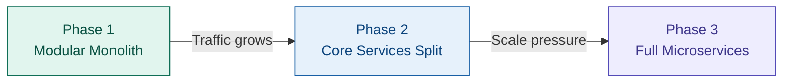

# Booma Ride Share Portal — Market Research

## 1. Overview

This document summarises research into existing ride-share platforms that offer web-based booking (without requiring a native mobile app), and the architectural patterns they employ at scale. The findings inform the design decisions for the Booma passenger portal.

---

## 2. Existing Web-Based Rideshare Platforms

### 2.1 Uber Web (web.uber.com)

Uber operates a progressive web application that allows passengers to book rides from any desktop or mobile browser without installing a native app. Key characteristics:

- Full ride booking, fare estimation, and live driver tracking available via browser
- Built on React with server-side rendering for fast first-paint
- Uses WebSockets for real-time driver location updates
- Progressive Web App (PWA) support — installable, offline-capable shell
- Authentication via email/SMS OTP and OAuth (Google, Apple)

### 2.2 Lyft Web

Lyft provides a web booking interface at ride.lyft.com, targeting markets where app installation friction is high.

- React-based SPA with lazy-loaded route bundles
- Mapbox GL JS for interactive maps in-browser
- Server-Sent Events (SSE) for ride status updates
- Strongly typed API surface using GraphQL

### 2.3 Ola (book.olacabs.com)

Ola's web portal is widely used across India, Australia, and the UK, particularly for pre-scheduled airport rides.

- Supports scheduled (advance) ride booking as its primary differentiator
- Angular frontend with REST APIs
- Favours SMS-based OTP authentication for markets with low social login adoption

### 2.4 Curb (curbapp.com)

Curb focuses on licensed taxi fleets in US cities. Their web portal is desktop-first, targeting corporate travel bookers.

- Supports booking on behalf of others (delegate booking)
- REST + webhook architecture; no real-time map tracking in the web view
- Stripe for payments with invoicing support

### 2.5 Hitch (hitch.com)

A long-distance carpooling web platform; entirely web-first, no mobile app required.

- Next.js with static pre-rendering for route/price pages
- Standard REST backend, scheduled jobs for route matching
- Stripe Connect for split-fare payouts to drivers

### 2.6 BlaBlaCar (blablacar.com)

Europe's largest carpooling platform; web is the primary channel.

- React + Node.js BFF (backend-for-frontend)
- Elasticsearch for route search
- Commission-based payment model via Mangopay

---

## 3. Key Capabilities Required for a Web Booking Portal

Based on the competitive landscape, the following capabilities are table-stakes for a passenger-facing web portal:

| Capability | Notes |
|---|---|
| Address autocomplete | Google Places API or Mapbox Geocoding |
| Interactive map | Driver pins, route polyline, pickup marker |
| Fare estimation | Before booking confirmation |
| Real-time driver tracking | WebSocket connection post-booking |
| Ride status notifications | Accepted → En route → Arrived → In progress → Complete |
| Saved addresses | Home, Work, Favourites |
| Payment management | Card on file, digital wallets |
| Ride history | Past trips with receipt |
| Account management | Profile, password, notification preferences |
| Scheduled booking | Advance booking with reminder |

---

## 4. Architecture Patterns in Production

### 4.1 Evolution Pattern: Monolith → Microservices

Every major platform started with a monolith and progressively extracted services as scaling pressure demanded it. Uber famously operated 2,200+ microservices by 2020 before consolidating them under a Domain-Oriented Microservice Architecture (DOMA) to manage complexity.

**Lesson for Booma:** Begin with a modular monolith or a small set of well-bounded services. Extract into independent microservices only when a specific domain demonstrates independent scaling needs (e.g., the location service under peak demand).

### 4.2 Real-Time Communication

Platforms use a layered approach to real-time updates:

| Mechanism | Use Case |
|---|---|
| WebSocket (persistent) | Live driver location (updates every 4 seconds) |
| Server-Sent Events | Ride status changes (one-way, simpler) |
| Push Notifications | Background alerts (driver arrived, ride complete) |
| Long Polling | Fallback for restrictive networks |

### 4.3 Geospatial Indexing

Driver proximity search is the most latency-sensitive operation. Production platforms use:

- **H3 Hexagonal Grid** (Uber) — divides the globe into hexagonal cells, enabling O(1) neighbour lookups
- **Redis GEO** — `GEOSEARCH` commands for radius queries, suitable for regional scale
- **PostGIS** — spatial SQL queries for smaller deployments or analytics

### 4.4 Event Streaming

Apache Kafka is the dominant choice for inter-service communication at scale:

- Driver GPS updates stream into Kafka, consumed by matching, analytics, and tracking services independently
- Enables replay for debugging and backfill
- Decouples producers from consumers, allowing independent scaling

### 4.5 Data Storage Strategy

No single database fits all rideshare use cases:

| Store | Purpose |
|---|---|
| PostgreSQL / MySQL | User accounts, ride records, payments (ACID required) |
| Redis | Driver locations (hot, ephemeral), session cache, distributed locks |
| Cassandra / DynamoDB | High-write time-series (GPS history, analytics events) |
| Elasticsearch | Address search, ride history full-text search |

---

## 5. Security Patterns

### 5.1 Authentication

- **JWT (short-lived access tokens)** — 15 min expiry, stored in memory (not localStorage)
- **Refresh tokens** — 30-day rotation, stored in `HttpOnly` cookies
- **OAuth 2.0 / OIDC** — Social login via Google, Apple
- **MFA** — SMS OTP or TOTP for sensitive actions (payment changes, account recovery)

### 5.2 API Security

- All endpoints behind an API Gateway with rate limiting
- Driver ID and User ID always derived server-side from JWT claims — never trusted from request body
- Fare estimates always re-validated server-side at booking confirmation
- HTTPS enforced everywhere; HSTS headers set
- CORS restricted to known origins

### 5.3 Payment Security

- PCI-DSS compliance via tokenised card storage (Stripe/Braintree handle raw card data)
- No card numbers ever touch application servers
- Idempotency keys on all payment requests to prevent double-charges

---

## 6. Scaling Considerations

### 6.1 Regional Architecture

Rideshare is inherently regional — a Sydney booking never needs to touch a London server. Platforms zone their infrastructure:

- Deploy per-region clusters (e.g., `ap-southeast-2` for Australia)
- Use a global API Gateway for routing + CDN for static assets
- No cross-region data transfer for trip operations (latency and data sovereignty)

### 6.2 Peak Load Patterns

Demand spikes are predictable (Friday night, public events, bad weather):

- Kubernetes Horizontal Pod Autoscaler on stateless services
- Pre-warm instances ahead of known peak windows
- Circuit breakers on downstream dependencies (maps, payments)

### 6.3 Capacity Reference (Regional Scale)

| Metric | Example Figure |
|---|---|
| Active riders per region | ~1 million |
| Rides per month | ~5 million |
| GPS updates per second | ~10,000 (all active drivers) |
| Booking QPS (steady) | ~5 |
| Booking QPS (peak) | ~50–100 |

---

## 7. Conclusions and Recommendations for Booma

1. **Web-first is viable and proven.** Uber, Lyft, Ola, and BlaBlaCar all support full booking via browser. A mobile app can follow, sharing the same backend APIs.

2. **Start with a service-oriented monolith.** Split `auth`, `bookings`, `location`, and `payments` as logical modules within a single deployable initially. Extract to independent services when load warrants.

3. **WebSockets for real-time tracking.** This is the standard; implement a WebSocket gateway from day one.

4. **Redis for driver locations.** `GEOSEARCH` covers regional scale cheaply. H3 is an optimisation for when Redis GEO becomes a bottleneck.

5. **Stripe for payments.** Handles PCI compliance, supports Australian payment methods, and provides webhook events for async payment state.

6. **JWT + HttpOnly refresh cookies.** Most secure pattern for a web-only portal; eliminates XSS-based token theft risks.

7. **Deploy to `ap-southeast-2` (Sydney).** Single region initially; add `ap-southeast-4` (Melbourne) as a read replica and failover zone.

---

*Next: [02-architecture-overview.md](./02-architecture-overview.md)*
