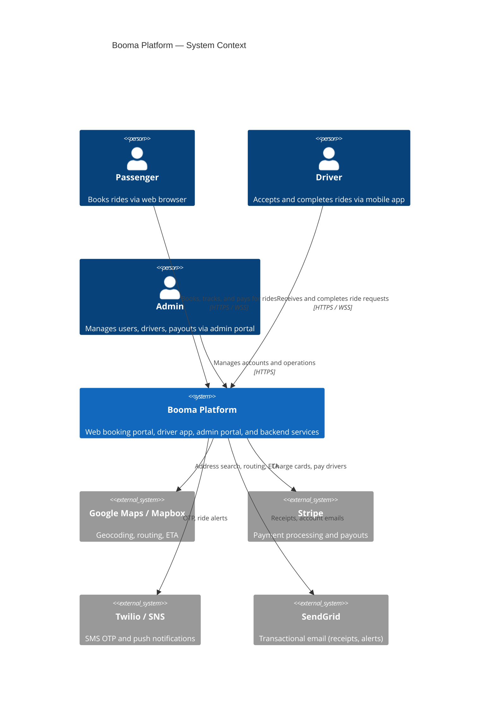
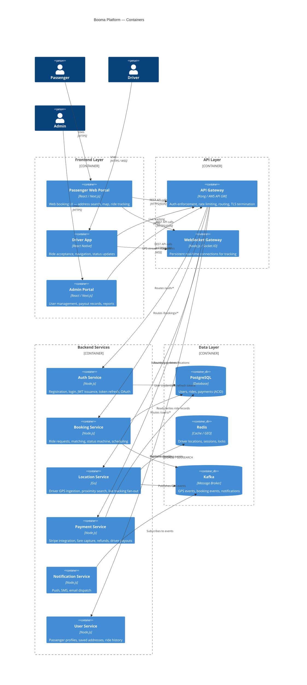
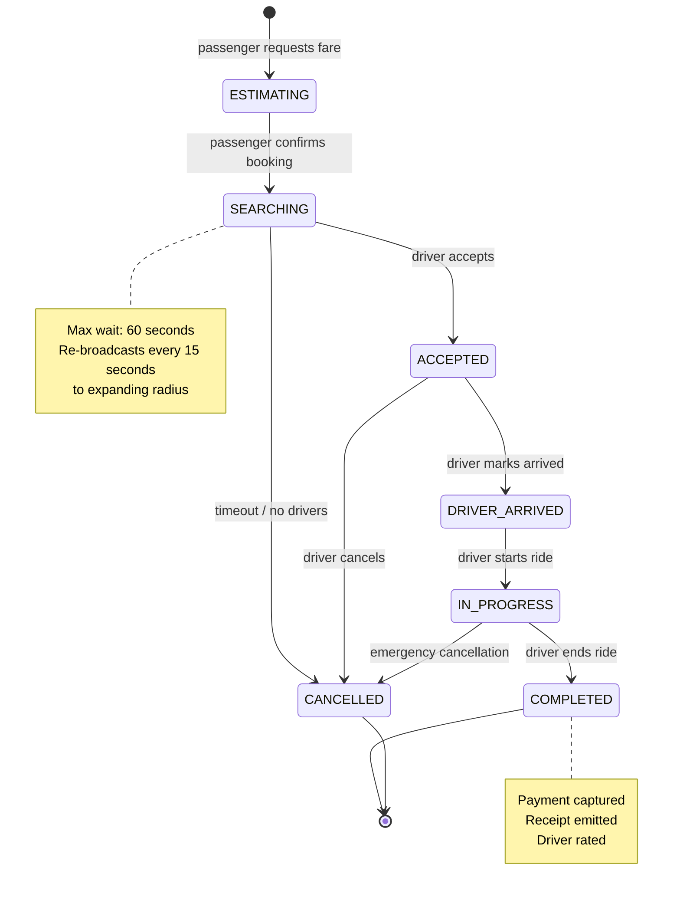
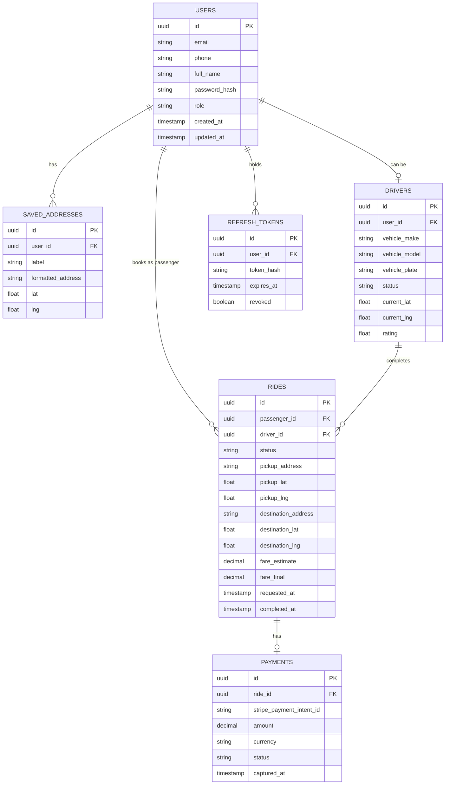
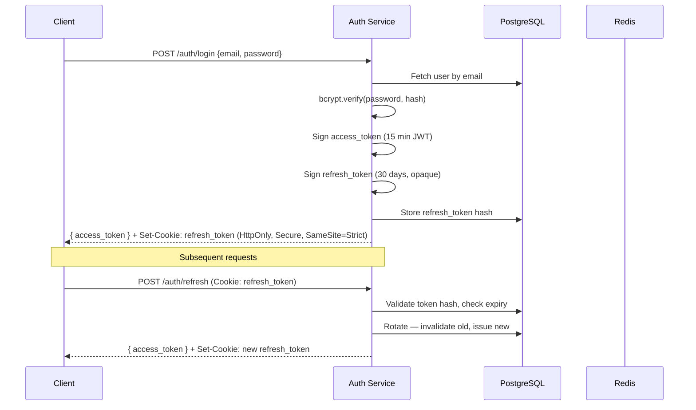
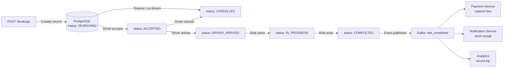
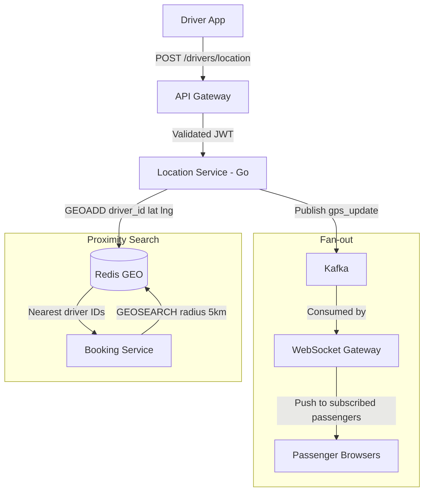

# Booma Ride Share Portal — Architecture Overview

## 1. Guiding Principles

| Principle | Rationale |
|---|---|
| **Web-first** | Passengers book via browser; no app install required |
| **Start modular, extract later** | Avoid premature microservice complexity |
| **Event-driven for real-time** | WebSocket + message queue decouple producers and consumers |
| **Regional isolation** | Trip data never crosses regions; reduces latency and meets data sovereignty requirements |
| **Security by default** | JWT in memory, refresh in HttpOnly cookie, server-side claim validation everywhere |
| **Replaceable components** | Each layer has a clean interface; swap implementations without rewriting callers |

---

## 2. High-Level System Context

The Booma platform serves three distinct user groups across two interfaces: a passenger web portal (the primary focus of this document) and a driver mobile app. A separate admin portal (as shown in the supplied design) manages user and driver accounts.



---

## 3. Container Architecture

The platform is structured as a set of backend services behind a unified API Gateway, with three frontend clients.



---

## 4. Ride Booking Flow

This is the core user journey: a passenger requests a ride, a driver is matched and accepts, and the ride is completed with payment captured.

```mermaid
sequenceDiagram
    autonumber
    actor P as Passenger (Browser)
    participant WP as Web Portal
    participant GW as API Gateway
    participant BS as Booking Service
    participant LS as Location Service
    participant PS as Payment Service
    participant NS as Notification Service
    actor D as Driver App

    P->>WP: Enter pickup + destination
    WP->>GW: GET /bookings/estimate
    GW->>BS: Forward (JWT validated)
    BS->>LS: Find nearest drivers (GEOSEARCH)
    LS-->>BS: Driver list + ETAs
    BS-->>WP: Fare estimate, ETA, vehicle options

    P->>WP: Confirm booking
    WP->>GW: POST /bookings
    GW->>BS: Create ride record (status: SEARCHING)
    BS->>LS: Query nearby available drivers
    BS->>D: Push ride request via WebSocket
    D->>GW: POST /bookings/{id}/accept
    GW->>BS: Update status: ACCEPTED
    BS->>NS: Emit booking_accepted event
    NS-->>P: Browser notification + status update

    loop Every 4 seconds
        D->>GW: POST /drivers/location {lat, lng}
        GW->>LS: Update Redis GEO
        LS-->>WP: Fan-out via WebSocket (driver pin moves)
    end

    D->>GW: POST /bookings/{id}/arrived
    BS->>NS: Emit driver_arrived event
    NS-->>P: "Your driver has arrived"

    D->>GW: POST /bookings/{id}/start
    BS: Update status: IN_PROGRESS

    D->>GW: POST /bookings/{id}/complete
    BS->>PS: Capture payment (Stripe)
    PS-->>BS: Payment confirmed
    BS: Update status: COMPLETED
    BS->>NS: Emit ride_completed event
    NS-->>P: Receipt email + in-app confirmation
```

---

## 5. Ride State Machine

Every ride record moves through a well-defined set of states. Invalid transitions are rejected by the Booking Service.



---

## 6. Data Model (Conceptual ERD)



---

## 7. Frontend Architecture (Passenger Web Portal)

```mermaid
graph TD
    subgraph Browser
        A[Next.js App Router]
        B[React Server Components]
        C[Client Components]
        D[Zustand — Global State]
        E[React Query — Server State]
        F[MapboxGL — Interactive Map]
        G[WebSocket Client]
    end

    subgraph Pages
        P1[/ — Landing / Login]
        P2[/book — Booking Flow]
        P3[/ride/:id — Live Tracking]
        P4[/history — Past Rides]
        P5[/account — Profile / Payments]
    end

    A --> B
    A --> C
    C --> D
    C --> E
    P2 --> F
    P3 --> F
    P3 --> G
    E -->|REST calls| API[API Gateway]
    G -->|WSS| WSG[WebSocket Gateway]
```

### 7.1 Key Frontend Libraries

| Library | Purpose |
|---|---|
| Next.js 14 (App Router) | SSR, routing, image optimisation |
| React 18 | UI component tree |
| Zustand | Lightweight global state (auth, active ride) |
| React Query (TanStack) | Data fetching, caching, background refresh |
| MapboxGL JS | Interactive map, driver pins, route polyline |
| Socket.IO Client | WebSocket with auto-reconnect |
| React Hook Form + Zod | Form validation |
| Tailwind CSS | Utility-first styling |

---

## 8. Backend Service Design

### 8.1 Auth Service

Responsibilities: registration, login, JWT issuance, token refresh, OAuth callback, password reset.



### 8.2 Booking Service State Transitions

The Booking Service owns the canonical ride state and enforces all valid transitions. It publishes events to Kafka on every state change so downstream services (notifications, payments, analytics) react without tight coupling.



### 8.3 Location Service

The Location Service is the most write-intensive component. Every active driver posts a GPS coordinate every 4 seconds.



---

## 9. Infrastructure and Deployment

```mermaid
graph TD
    subgraph CDN [CloudFront / Cloudflare CDN]
        STA[Static Assets\nJS, CSS, Images]
    end

    subgraph AWS ap-southeast-2 [AWS Region — Sydney]
        subgraph VPC
            subgraph Public Subnet
                ALB[Application Load Balancer\nHTTPS + WSS]
                NATGW[NAT Gateway]
            end

            subgraph Private Subnet — Services
                GW[API Gateway\nKong]
                WSGATE[WebSocket Gateway\nNode.js]
                AUTH[Auth Service]
                BOOK[Booking Service]
                LOC[Location Service\nGo]
                PAY[Payment Service]
                NOTIF[Notification Service]
            end

            subgraph Private Subnet — Data
                PG[(RDS PostgreSQL\nMulti-AZ)]
                REDIS[(ElastiCache Redis\nCluster)]
                MSK[(MSK Kafka\nManaged)]
            end
        end
    end

    subgraph External
        STRIPE[Stripe API]
        MAPS[Mapbox / Google Maps]
        TWILIO[Twilio SMS]
        SENDGRID[SendGrid]
    end

    Internet -->|HTTPS| CDN
    Internet -->|HTTPS / WSS| ALB
    ALB --> GW
    ALB --> WSGATE
    GW --> AUTH & BOOK & PAY & NOTIF
    WSGATE --> LOC
    LOC --> REDIS & MSK
    BOOK --> PG & MSK
    AUTH --> PG
    PAY --> STRIPE
    NOTIF --> TWILIO & SENDGRID
    LOC --> MAPS
```

### 9.1 Kubernetes Workload Summary

| Service | Replicas (normal) | Replicas (peak) | Scaling Trigger |
|---|---|---|---|
| API Gateway (Kong) | 2 | 4 | CPU > 70% |
| Auth Service | 2 | 4 | RPS > 500 |
| Booking Service | 2 | 6 | RPS > 200 |
| Location Service | 3 | 10 | Message lag > 1s |
| WebSocket Gateway | 3 | 8 | Connections > 5,000 |
| Payment Service | 2 | 4 | RPS > 100 |
| Notification Service | 2 | 4 | Queue depth |

---

## 10. Non-Functional Requirements Summary

| Requirement | Target | Approach |
|---|---|---|
| API response time (p99) | < 500 ms | Redis caching, DB read replicas |
| WebSocket latency | < 1 second | Go location service, Redis pub/sub |
| Availability | 99.9% | Multi-AZ RDS, Redis cluster, K8s restarts |
| Throughput | 100 bookings/sec peak | Horizontal pod autoscaling |
| Payment reliability | Zero double-charges | Stripe idempotency keys |
| Data residency | Australia | All services in `ap-southeast-2` |

---

*Previous: [01-market-research.md](./01-market-research.md) | Next: [03-security-architecture.md](./03-security-architecture.md)*
