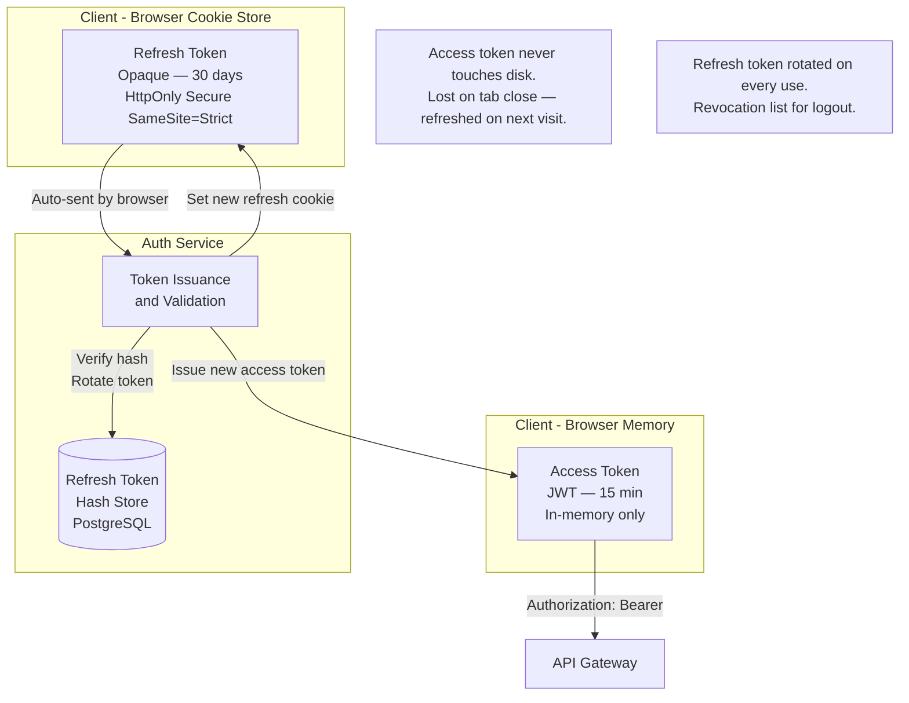
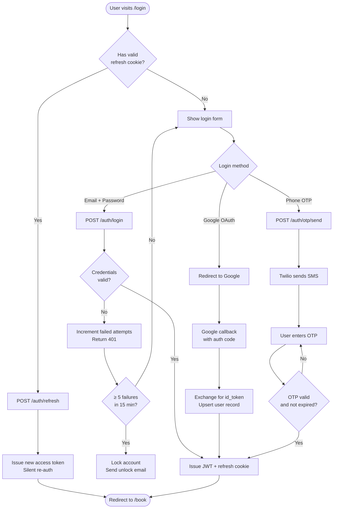
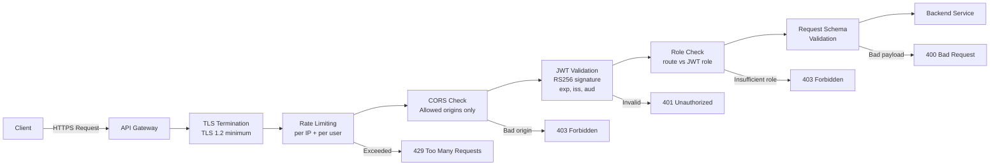
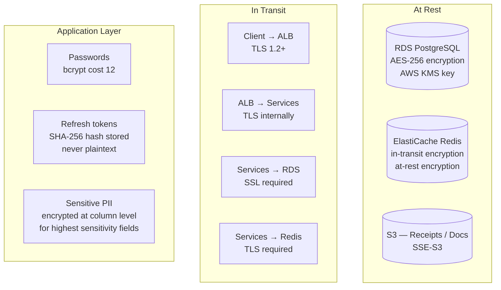
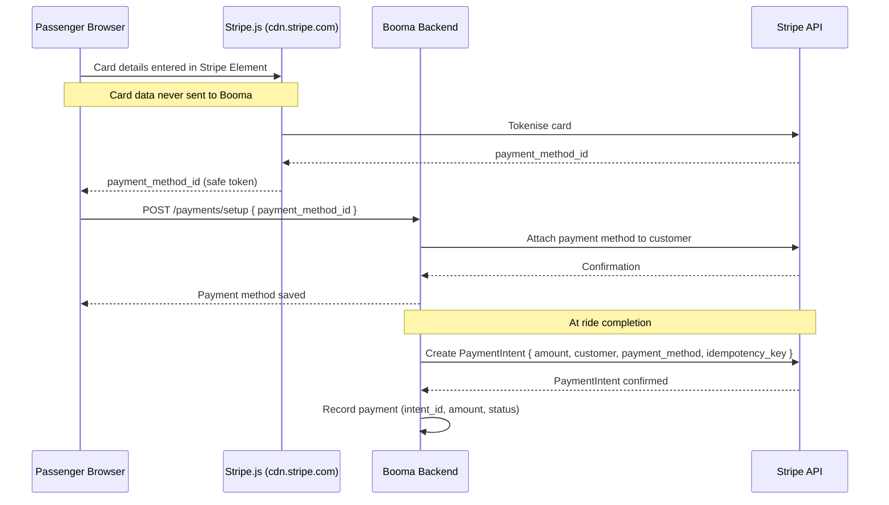
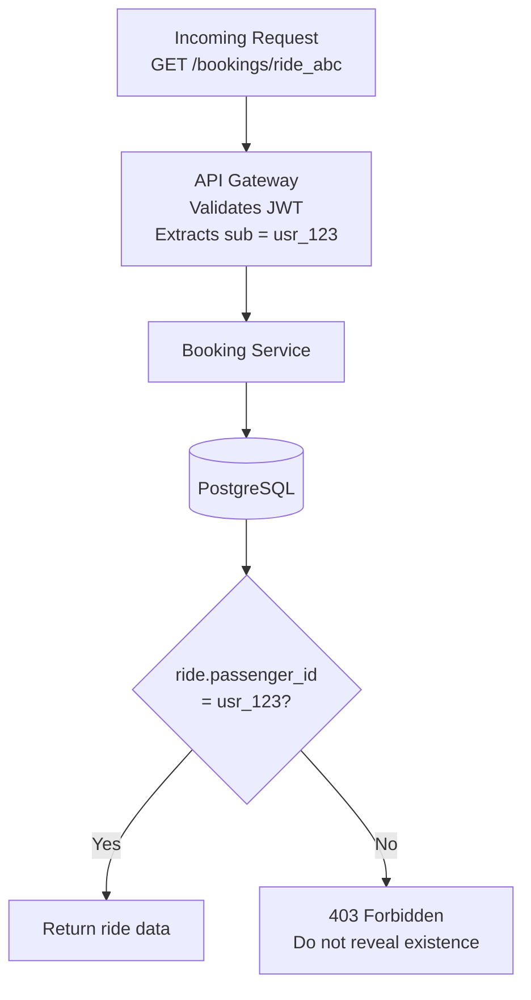
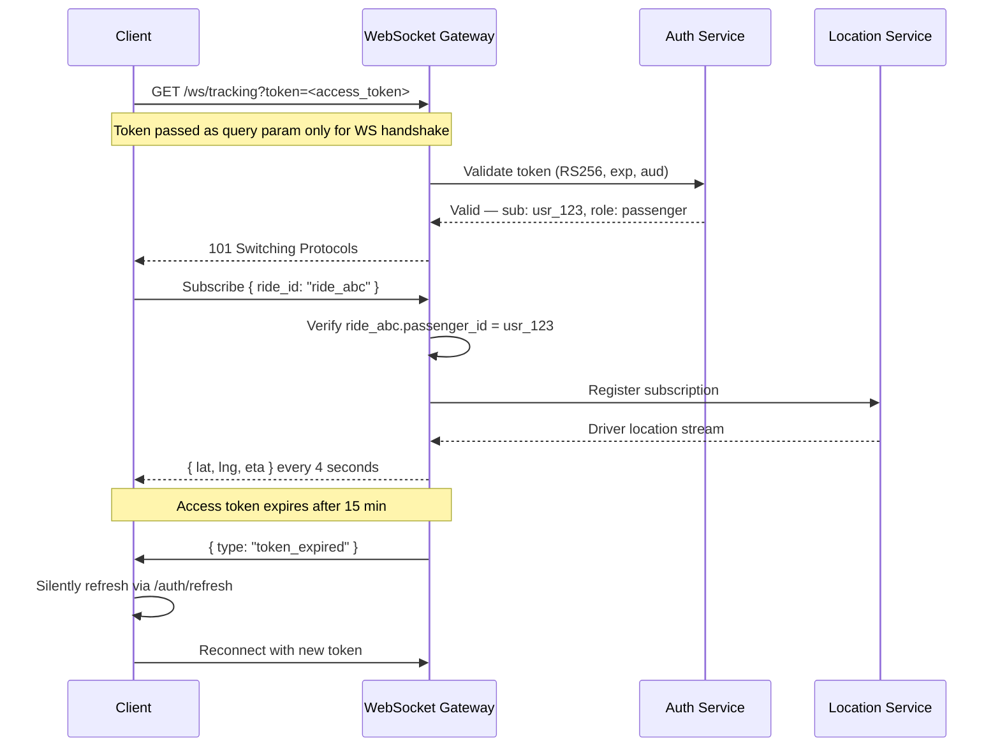

# Booma Ride Share Portal — Security Architecture

## 1. Threat Model Summary

The passenger web portal faces a different threat profile to a native mobile app. The primary concerns are:

| Threat | Vector | Mitigation |
|---|---|---|
| Token theft | XSS stealing access tokens from localStorage | Store access tokens in memory only; refresh token in HttpOnly cookie |
| Session hijacking | Cookie theft via network or XSS | `HttpOnly`, `Secure`, `SameSite=Strict` cookie attributes |
| CSRF | Forged cross-site requests | `SameSite=Strict` cookie + CSRF token for state-mutating requests |
| Fare tampering | Client sending manipulated fare amounts | All fares re-validated server-side; never trust client-submitted prices |
| Account takeover | Credential stuffing, brute force | Rate limiting on `/auth/login`, account lockout, MFA |
| API abuse | Automated booking / scraping | Rate limiting per IP and per user, CAPTCHA on registration |
| Injection | SQL / NoSQL injection | Parameterised queries, ORM usage, input schema validation (Zod) |
| Insecure direct object reference | Accessing another user's ride | All resource access checks ownership against JWT `sub` claim |
| Payment fraud | Double charge, refund abuse | Stripe idempotency keys, server-side amount calculation |
| Driver spoofing | Fake GPS coordinates | Plausibility checks on GPS jumps, anomaly detection |

---

## 2. Authentication Architecture

### 2.1 Token Strategy



### 2.2 Registration and Login Flow



### 2.3 JWT Claims Structure

Access tokens are signed with RS256 (asymmetric). The public key is distributed to all services so they can validate tokens without calling the Auth Service on every request.

```json
{
  "iss": "https://auth.booma.com.au",
  "sub": "usr_01J8XK...",
  "aud": "booma-api",
  "exp": 1711234567,
  "iat": 1711233667,
  "role": "passenger",
  "email_verified": true,
  "jti": "tok_01J8XK..."
}
```

**Key rules enforced by the API Gateway:**

- Reject tokens with `exp` in the past
- Reject tokens not issued by `iss: https://auth.booma.com.au`
- Reject tokens with `aud` ≠ `booma-api`
- `sub` is the only trusted user identifier — never use a user ID from the request body
- `role` determines which routes are accessible

---

## 3. API Gateway Security Layer

Every inbound request passes through the API Gateway before reaching any backend service. The gateway enforces:



### 3.1 Rate Limiting Tiers

| Endpoint | Limit | Window |
|---|---|---|
| `POST /auth/login` | 10 requests | per IP per minute |
| `POST /auth/otp/send` | 3 requests | per phone per 15 min |
| `POST /bookings` | 5 requests | per user per minute |
| `GET /bookings/estimate` | 30 requests | per user per minute |
| `POST /drivers/location` | 20 requests | per driver per minute |
| All other authenticated | 120 requests | per user per minute |
| All other unauthenticated | 30 requests | per IP per minute |

---

## 4. Data Security

### 4.1 Data Classification

| Classification | Examples | Controls |
|---|---|---|
| **Restricted** | Password hashes, refresh token hashes, Stripe keys | Never logged, encrypted at rest, access audit trail |
| **Confidential** | Email, phone, full name, payment method last4 | Encrypted at rest (RDS encryption), HTTPS in transit |
| **Internal** | Ride records, driver locations, fare history | Accessible to authenticated users who own the record |
| **Public** | Fare estimates (unauthenticated), platform status | No controls required |

### 4.2 Encryption



### 4.3 Payment Security

Booma never handles raw card data. The Stripe.js library loads directly from Stripe's CDN and tokenises card details entirely in the browser before any data reaches Booma servers.



---

## 5. Authorisation Model

Every resource access enforces ownership. The user's identity is always derived from the JWT `sub` claim — never from the request body or URL parameter.



### 5.1 Role Matrix

| Role | Book rides | View own rides | View all rides | Manage users | Manage drivers | Access admin portal |
|---|---|---|---|---|---|---|
| `passenger` | ✅ | ✅ | ❌ | ❌ | ❌ | ❌ |
| `driver` | ❌ | ✅ | ❌ | ❌ | ❌ | ❌ |
| `admin` | ❌ | ✅ | ✅ | ✅ | ✅ | ✅ |
| `super_admin` | ❌ | ✅ | ✅ | ✅ | ✅ | ✅ |

---

## 6. WebSocket Security

WebSocket connections bypass HTTP-layer middleware once upgraded. Specific controls apply:



**WebSocket controls:**

- Token validated on connection initiation, not just at upgrade
- Subscriptions are scoped — a passenger can only subscribe to their own active ride
- Connections are limited to 2 per user (prevents tab multiplication attacks)
- Inbound message size limit: 1 KB (GPS updates only; no large payloads accepted)
- Idle connections closed after 90 seconds of no ping

---

## 7. Infrastructure Security

```mermaid
graph TD
    subgraph Internet
        USR[Users / Drivers]
        ATK[Potential attackers]
    end

    subgraph Edge
        WAF[AWS WAF\nOWASP ruleset\nBot control]
        CF[CloudFront CDN\nDDoS protection\nGeo-blocking if needed]
    end

    subgraph VPC — ap-southeast-2
        subgraph Public Subnet
            ALB[ALB — HTTPS only\nHTTP redirected to HTTPS]
        end

        subgraph Private Subnet — App
            SVC[Backend Services\nNo public IPs]
        end

        subgraph Private Subnet — Data
            DB[(RDS — no public access)]
            CACHE[(Redis — no public access)]
        end

        SG1[Security Group — ALB\nInbound 443 only]
        SG2[Security Group — Services\nInbound from ALB SG only]
        SG3[Security Group — Data\nInbound from Services SG only]
    end

    USR -->|HTTPS| CF
    ATK -->|Filtered| WAF
    WAF --> CF
    CF --> ALB
    ALB --> SVC
    SVC --> DB
    SVC --> CACHE
```

### 7.1 Security Controls Checklist

| Control | Status | Implementation |
|---|---|---|
| TLS everywhere | Required | ACM certificate on ALB; internal TLS between services |
| HSTS | Required | `Strict-Transport-Security: max-age=31536000; includeSubDomains` |
| CSP | Required | `Content-Security-Policy` header on all HTML responses |
| Secrets management | Required | AWS Secrets Manager; no secrets in environment variables or code |
| Dependency scanning | Required | `npm audit` in CI; Dependabot PRs |
| Container scanning | Required | ECR image scanning on push |
| Penetration testing | Required | Annual third-party pen test; bug bounty programme |
| Audit logging | Required | All auth events, payment events, admin actions logged to CloudWatch |
| GDPR / Privacy Act | Required | Data deletion endpoint; privacy policy; consent at registration |

---

*Previous: [02-architecture-overview.md](./02-architecture-overview.md) | Next: [04-scaling-strategy.md](./04-scaling-strategy.md)*
