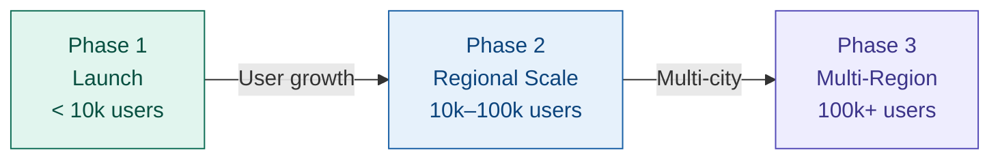
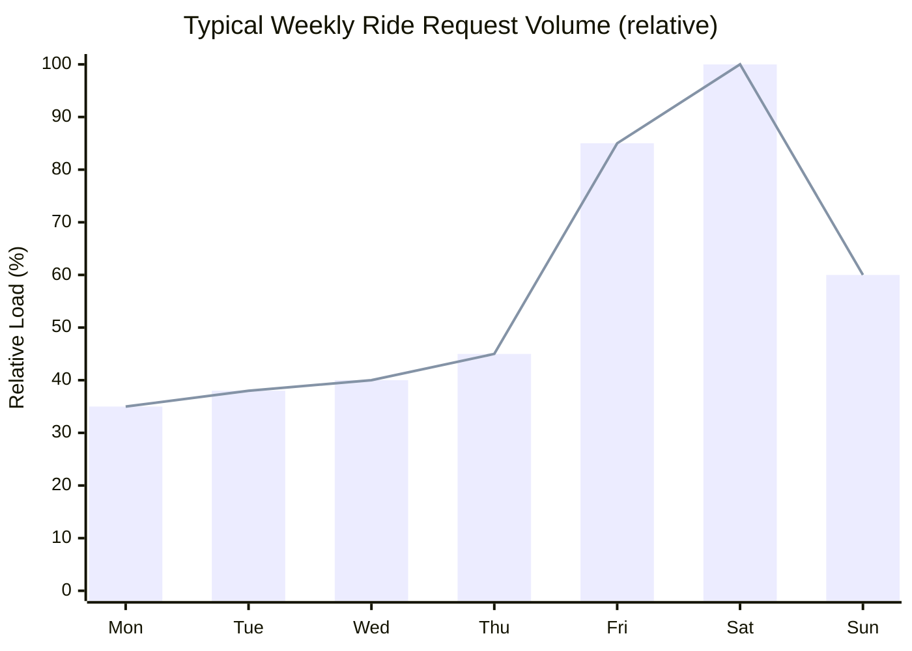
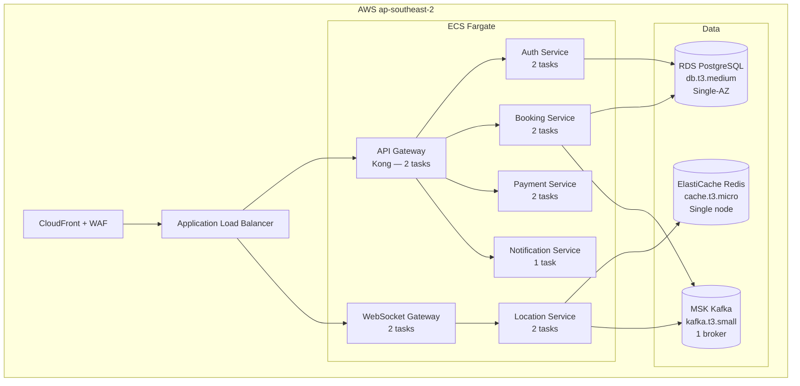
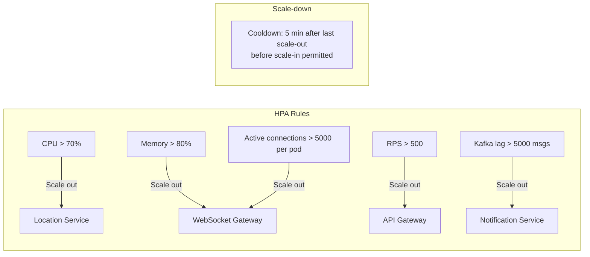
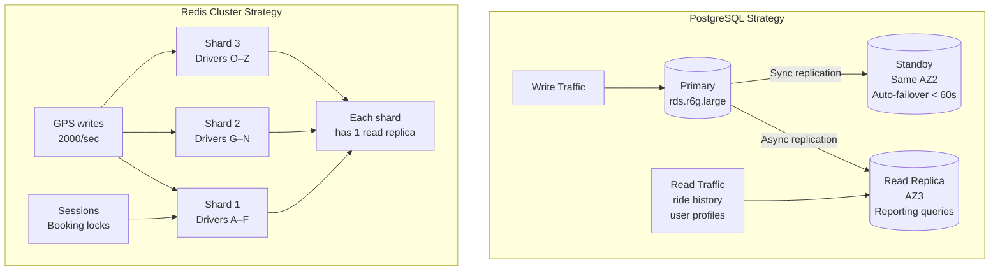
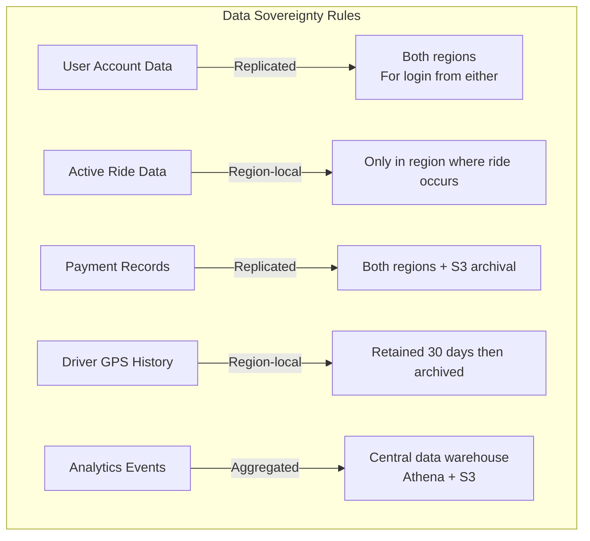
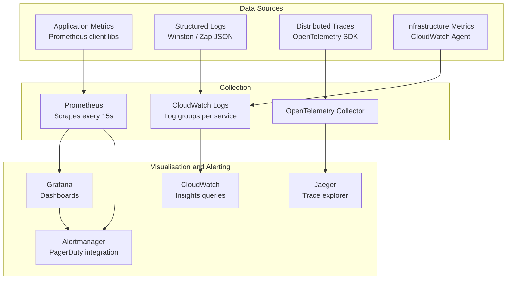
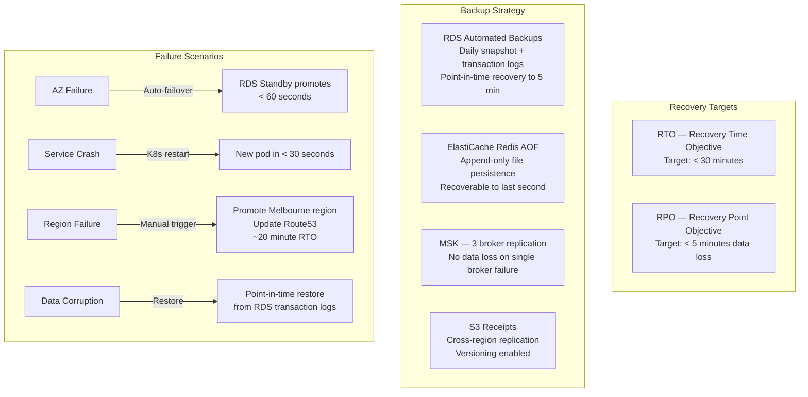

# Booma Ride Share Portal — Scaling Strategy

## 1. Scaling Philosophy

Booma should be built to scale *incrementally* — each phase adds capacity only where load demands it, avoiding over-engineering at launch while ensuring no ceiling blocks future growth.



---

## 2. Load Characteristics

Understanding rideshare load patterns is critical to scaling correctly.

### 2.1 Temporal Load Patterns

Rideshare demand is highly predictable. Infrastructure should pre-warm before known peaks rather than react after they hit.



**Intra-day peaks:**
- 07:00–09:00 — Morning commute (~2× baseline)
- 17:00–19:00 — Evening commute (~2.5× baseline)
- 21:00–02:00 Friday/Saturday — Nightlife (~4× baseline)

### 2.2 Load by Service Type

Different services have fundamentally different load profiles:

| Service | Load Type | Dominant Metric | Peak Rate (Phase 2) |
|---|---|---|---|
| Location Service | Write-heavy, high frequency | GPS updates | ~2,000/sec |
| WebSocket Gateway | Connection-heavy | Active connections | ~20,000 |
| Booking Service | Moderate read/write | Ride requests | ~50/sec |
| Auth Service | Bursty | Login events | ~200/sec |
| Payment Service | Low volume, high reliability | Payment captures | ~10/sec |
| Notification Service | Async, spiky | Events queued | ~500/sec |

---

## 3. Phase 1 — Launch Architecture

A lean, cost-effective stack that can be stood up quickly and handles the initial user base.



**Phase 1 constraints:**
- Single availability zone (tolerate brief outages for cost savings at launch)
- No autoscaling — fixed task counts
- Shared PostgreSQL instance for all services
- Single Redis node (no cluster)
- Estimated monthly cost: ~AUD $1,200–1,800

---

## 4. Phase 2 — Regional Scale

Triggered when any of: 10,000 registered users, 1,000 concurrent rides, or single-AZ incidents causing business impact.

```mermaid
graph TD
    subgraph AWS ap-southeast-2 Multi-AZ
        CF[CloudFront + WAF]
        ALB[ALB — Multi-AZ]

        subgraph EKS Kubernetes
            subgraph Stateless Services — HPA enabled
                API[API Gateway\nKong — 2–8 pods]
                WS[WebSocket Gateway\n3–12 pods]
                AUTH[Auth — 2–6 pods]
                BOOK[Booking — 2–8 pods]
                LOC[Location — Go — 3–12 pods]
                PAY[Payment — 2–4 pods]
                NOTIF[Notification — 2–6 pods]
            end
        end

        subgraph Data — HA
            PG[(RDS PostgreSQL\nMulti-AZ\nRead Replica)]
            REDIS[(ElastiCache Redis\nCluster mode\n3 shards)]
            MSK[(MSK Kafka\n3 brokers\n3 AZs)]
        end

        subgraph Observability
            CW[CloudWatch\nMetrics + Logs]
            XRAY[X-Ray Tracing]
            GRAFANA[Grafana Dashboard]
        end
    end

    CF --> ALB
    ALB --> API & WS
    API --> AUTH & BOOK & PAY & NOTIF
    WS --> LOC
    LOC --> REDIS & MSK
    BOOK --> PG & MSK
    AUTH --> PG
    SVC --> CW & XRAY
```

### 4.1 Horizontal Pod Autoscaler Configuration



### 4.2 Database Scaling



---

## 5. Phase 3 — Multi-Region

Triggered when expanding to additional Australian cities with significant market share, or when SLA requirements demand < 50ms regional latency.

```mermaid
graph TD
    subgraph Global Edge
        R53[Route 53\nLatency-based routing]
        CF[CloudFront\nGlobal CDN]
    end

    subgraph Region — Sydney ap-southeast-2
        SYD_ALB[ALB]
        SYD_SVC[All Services]
        SYD_DB[(PostgreSQL Primary)]
        SYD_CACHE[(Redis Cluster)]
        SYD_KAFKA[(Kafka — 3 brokers)]
    end

    subgraph Region — Melbourne ap-southeast-4
        MEL_ALB[ALB]
        MEL_SVC[All Services]
        MEL_DB[(PostgreSQL Replica\nRead-heavy queries)]
        MEL_CACHE[(Redis Cluster)]
        MEL_KAFKA[(Kafka — 3 brokers)]
    end

    R53 -->|Sydney users| SYD_ALB
    R53 -->|Melbourne users| MEL_ALB
    CF --> R53

    SYD_DB -->|Cross-region replication\nasync — eventual consistency| MEL_DB

    note1[Trip data is region-local\nA Sydney ride never touches Melbourne DB\nOnly user profiles and accounts replicate cross-region]
```

### 5.1 Multi-Region Data Strategy



---

## 6. Real-Time Location Scaling Deep Dive

The Location Service is the highest-throughput component and requires specific scaling attention.

```mermaid
graph TD
    subgraph Driver Fleet — 500 active drivers
        D1[Driver App] & D2[Driver App] & DN[...] -->|POST /drivers/location\nevery 4 seconds| WS[WebSocket Gateway]
    end

    subgraph Location Service — Go
        WS -->|125 updates/sec at 500 drivers| INGEST[Ingest Handler\ngoroutine pool]
        INGEST -->|GEOADD| REDIS[(Redis GEO\ndriver:locations key)]
        INGEST -->|Publish| KAFKA[Kafka\nTopic: gps-updates\n3 partitions]
    end

    subgraph Fan-out to Passengers
        KAFKA -->|Consumed| FANOUT[Fan-out Worker\ngoroutine per partition]
        FANOUT -->|Filter: which passengers\nneed this driver?| SUB[(Subscription Map\nIn-memory + Redis)]
        FANOUT -->|Push| WSP[WebSocket Gateway\nPassenger connections]
        WSP -->|JSON { lat, lng, eta }| PASS[Passenger Browsers]
    end

    subgraph Proximity Search
        BOOK[Booking Service] -->|GEOSEARCH\nCOUNT 10 BYRADIUS 5 km ASC| REDIS
        REDIS -->|Nearest driver IDs| BOOK
    end
```

### 6.1 GPS Update Volume Projections

| Active Drivers | Updates/sec | Redis writes/sec | Kafka msgs/sec |
|---|---|---|---|
| 100 | 25 | 25 | 25 |
| 500 | 125 | 125 | 125 |
| 2,000 | 500 | 500 | 500 |
| 5,000 | 1,250 | 1,250 | 1,250 |
| 10,000 | 2,500 | 2,500 | 2,500 |

Redis can handle ~100,000 writes/second on a single node — the Location Service will not require Redis sharding until well beyond 100,000 active drivers. The bottleneck at scale is the fan-out to passenger WebSocket connections, not the write path.

---

## 7. Observability Stack

You cannot scale what you cannot see.



### 7.1 Key Metrics and Alert Thresholds

| Metric | Warning | Critical | Action |
|---|---|---|---|
| Booking service error rate | > 1% | > 5% | Page on-call, circuit break |
| GPS fan-out lag | > 2 sec | > 5 sec | Scale Location Service |
| WebSocket connection count per pod | > 4,000 | > 6,000 | Scale WS Gateway |
| RDS CPU | > 70% | > 90% | Promote read replica, investigate queries |
| Redis memory usage | > 70% | > 85% | Scale cluster shards |
| Payment error rate | > 0.5% | > 2% | Page on-call, check Stripe status |
| Auth token rejection rate | > 5% | > 20% | Possible token invalidation bug or attack |
| Kafka consumer lag | > 10,000 | > 50,000 | Scale Notification / Fan-out consumers |

---

## 8. Disaster Recovery



---

## 9. Cost Scaling Model

Infrastructure cost grows sub-linearly with users due to efficiency gains at scale.

| Phase | Users | Est. Monthly AWS Cost |
|---|---|---|
| Phase 1 — Launch | < 10,000 | AUD $1,200–1,800 |
| Phase 2 — Growth | 10,000–100,000 | AUD $4,000–8,000 |
| Phase 3 — Scale | 100,000–500,000 | AUD $12,000–25,000 |

Cost optimisations to apply progressively:
- Reserved Instances for RDS and ElastiCache (30–40% savings)
- Spot Instances for stateless services (50–70% savings on non-critical workloads)
- S3 Intelligent Tiering for archived GPS and ride history data
- CloudFront caching for static assets and fare estimate responses (reduce origin hits)

---

*Previous: [03-security-architecture.md](./03-security-architecture.md)*
